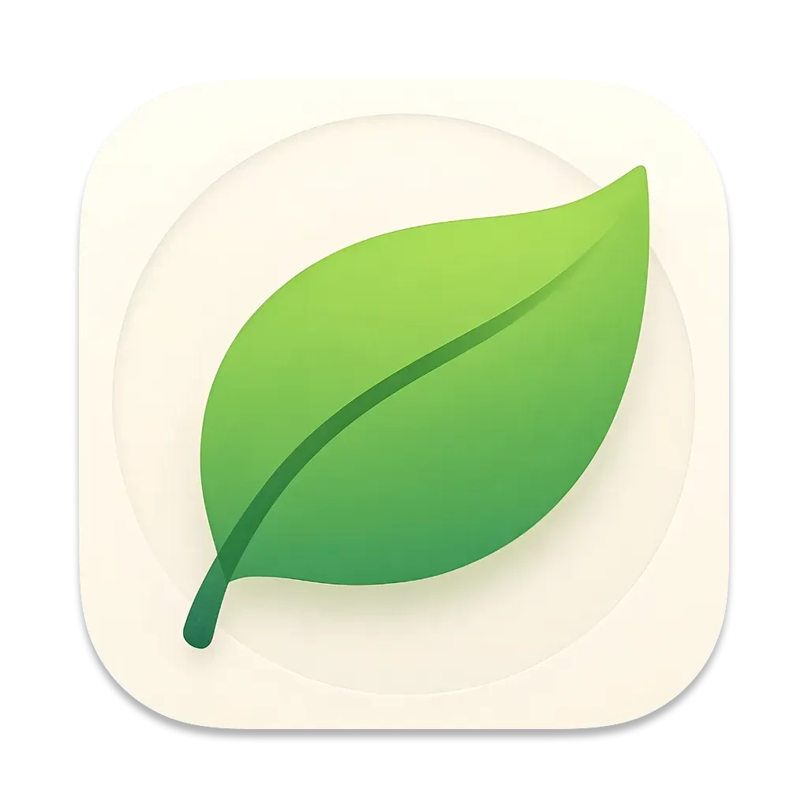

# Take a Break

  

<h3 align="center">A lightweight macOS app that reminds you to take regular breaks, improving focus and productivity while protecting your eye and back health.</h3>

  
  
  
  

  

## ✨ Features

### ⏰ Smart Break Reminders
- Customizable break intervals
- Gentle pre-break notifications

### 🔍 Intelligent Idle Detection
- Automatically pauses when you're away
- Customizable idle threshold settings
- Smart resume when you return to your computer

### 🖼️ Beautiful Break Experience
- Distraction-free full-screen break mode
- Customizable wallpapers for break screens
- Motivational quotes during breaks
- Current time display

## 🔒 Privacy

We take your privacy seriously:
- No data collection or tracking
- No internet connection required for core functionality
- All settings stored locally on your device

## 💻 System Requirements

- macOS (latest version recommended)
- Minimal system resources
- No additional dependencies required

## 📥 Installation

1. Download the latest version from our [releases page](#)
2. Move the app to your Applications folder
3. Launch Take a Break
4. Grant necessary permissions when prompted

## 🤝 Support

If you encounter any issues or have suggestions, please:
- Open an issue in this repository
- Contact support at [support@takeabreak.app](mailto:support@takeabreak.app)

## 📜 License

© 2025 Prakash Joshi Pax. All rights reserved.

---

Made with ❤️ by <a href="https://github.com/beingpax">Prakash Joshi Pax</a>
 